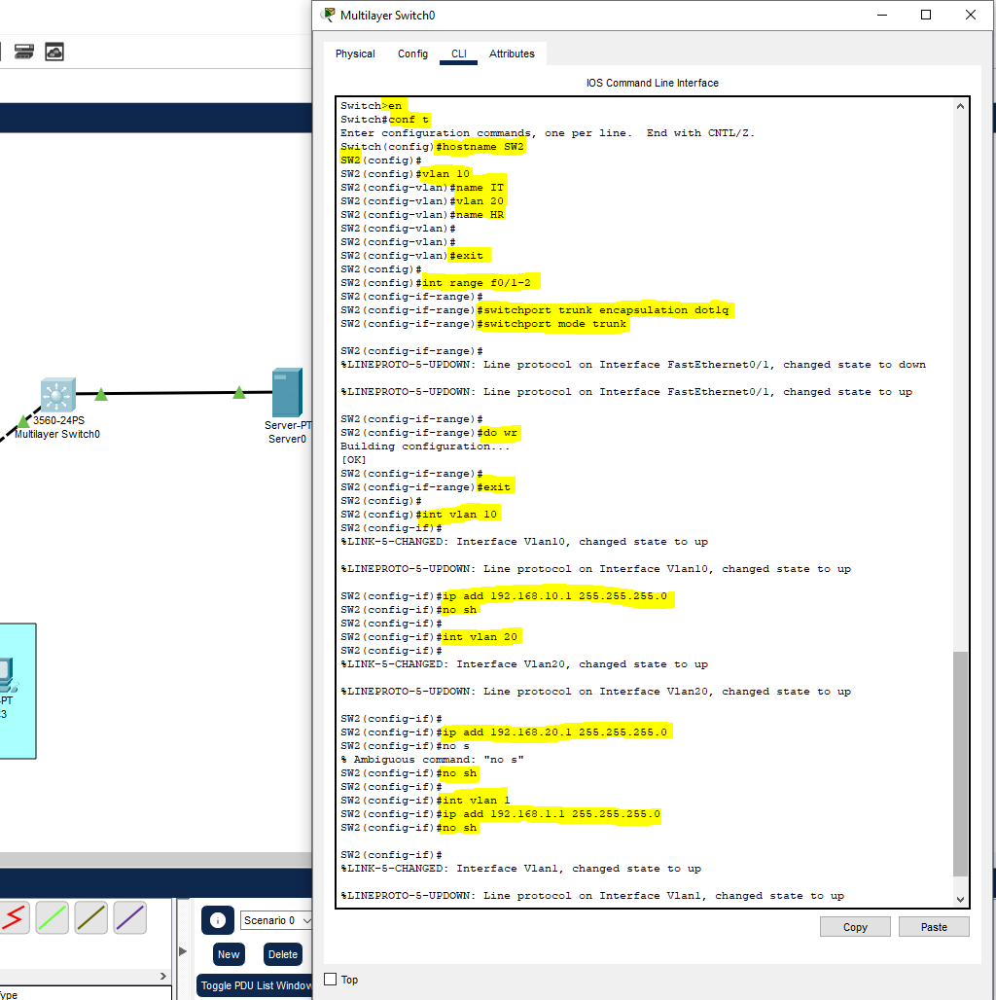
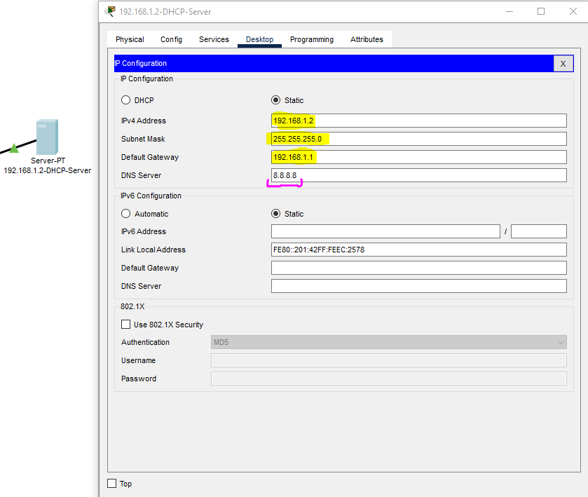
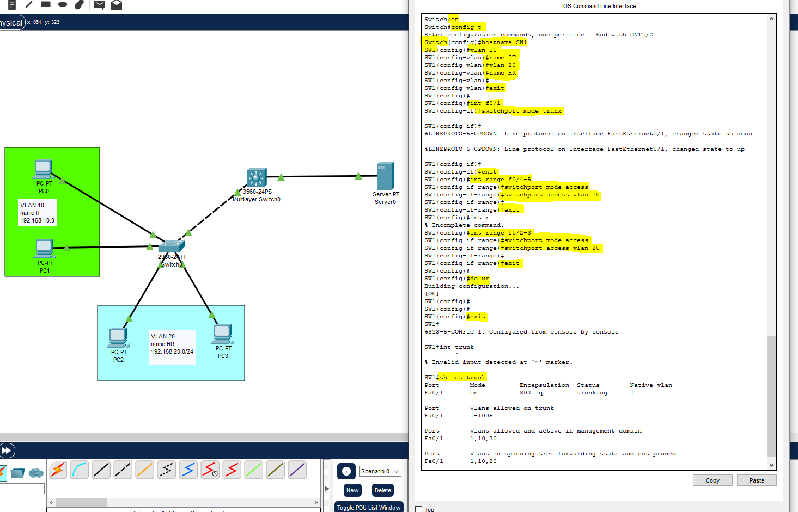
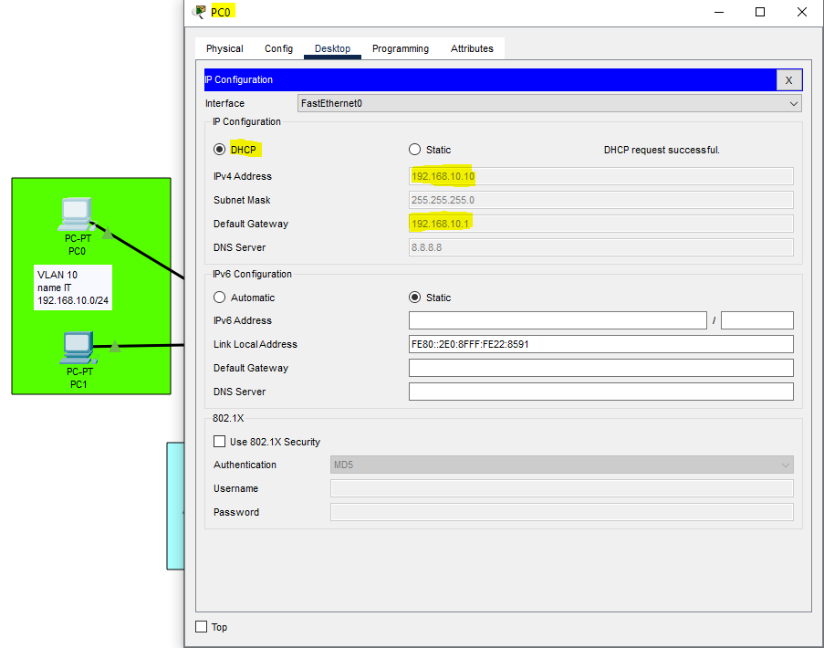
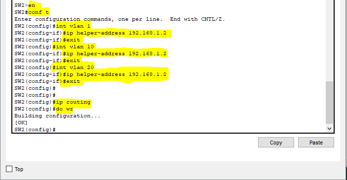
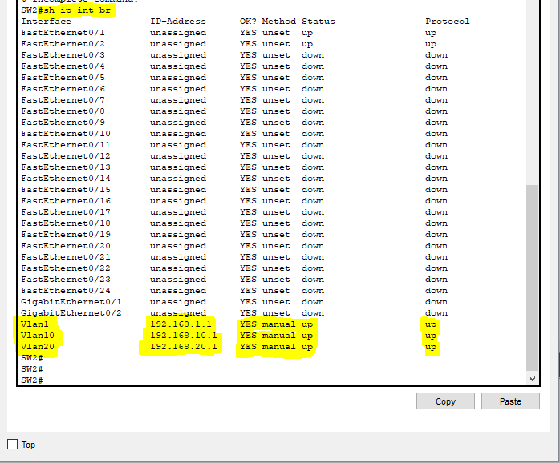
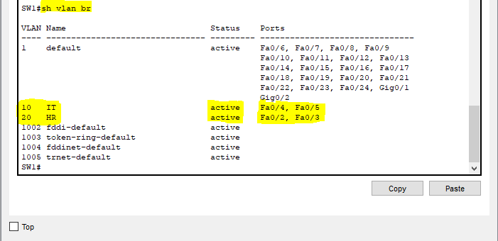
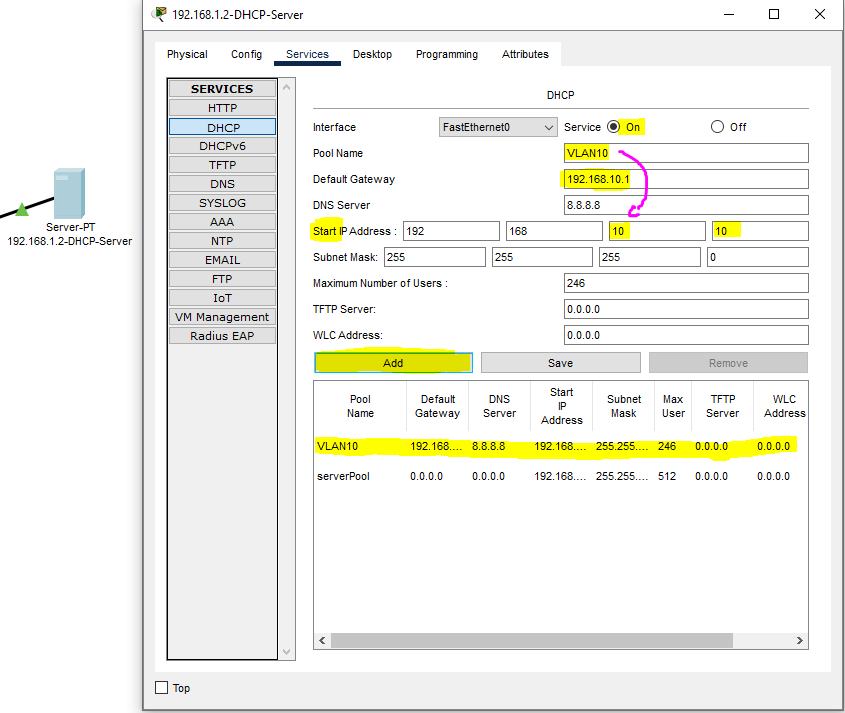
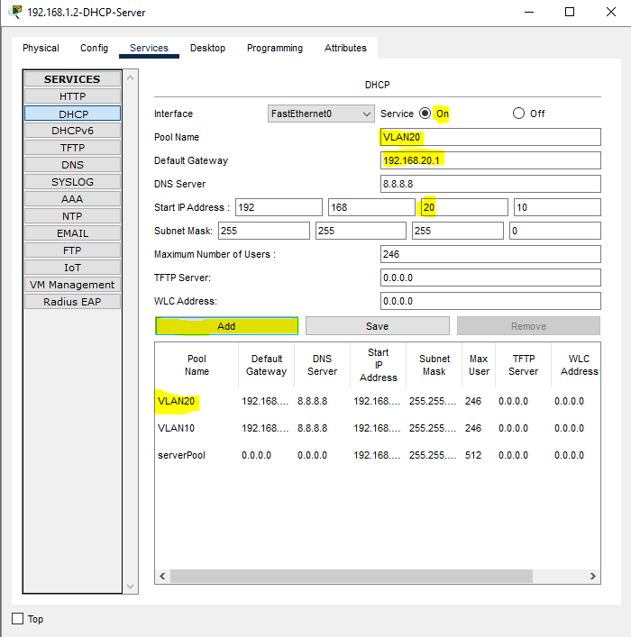
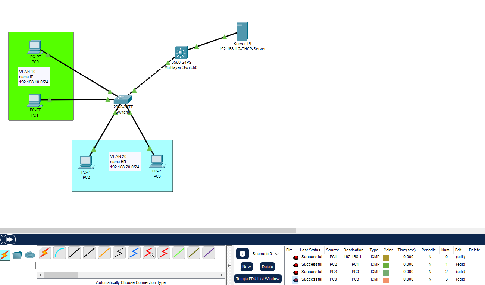

# DHCP-Server-multiple-VLAN-CiscoPT-Lab

## Opis Labu

Ten lab demonstruje konfigurację serwera DHCP do obsługi wielu sieci VLAN (Virtual Local Area Networks). Sieć jest podzielona na dwa VLAN-y: VLAN 10 (nazwa: IT) i VLAN 20 (nazwa: HR). MultiLayer Switch pełni rolę zarówno przełącznika warstwy drugiej do segmentacji VLAN-ów, jak i routera warstwy trzeciej do umożliwienia komunikacji między VLAN-ami oraz z serwerem DHCP. Serwer DHCP jest skonfigurowany do przypisywania adresów IP z odpowiednich pul adresowych do urządzeń w każdym VLAN-ie.

**Kluczowe Konfiguracje:**

* **VLAN-y:** Stworzone VLAN-y 10 (IT) i 20 (HR).
* **Interfejsy VLAN:** Skonfigurowane interfejsy wirtualne (SVI - Switch Virtual Interface) dla VLAN-ów 10 i 20 na MultiLayer Switchu z przypisanymi adresami IP pełniącymi rolę bramek domyślnych dla hostów w tych VLAN-ach.
* **Trunk:** Skonfigurowane łącze trunkujące (port Fa0/1 na SW1) między Switchem Dostępowym (SW1) a MultiLayer Switchem, umożliwiające przesyłanie ruchu z wielu VLAN-ów.
* **IP Helper Address:** Skonfigurowany na interfejsach VLAN 10 i 20 MultiLayer Switcha, aby przekazywać żądania DHCP od klientów w tych VLAN-ach do serwera DHCP znajdującego się w innej sieci.
* **Serwer DHCP:** Skonfigurowany z dwoma zakresami (scope) adresów IP, po jednym dla każdego VLAN-u (10 i 20), oraz z odpowiednimi opcjami (brama domyślna, serwer DNS).

## Wyjaśnienie Zrzutów Ekranu i Komend

**Zrzut Ekranu 1:** Konfiguracja MultiLayer Switcha (oznaczonego jako "MultiLayer Switch0").

* `Switch(config)# hostname SW2`: Zmiana nazwy hosta na SW2.
* `SW2(config)# vlan 10`: Utworzenie VLAN-u o ID 10.
* `SW2(config-vlan)# name IT`: Nadanie nazwy "IT" dla VLAN-u 10.
* `SW2(config)# vlan 20`: Utworzenie VLAN-u o ID 20.
* `SW2(config-vlan)# name HR`: Nadanie nazwy "HR" dla VLAN-u 20.
* `SW2(config)# interface range f0/2-3`: Wybranie zakresu interfejsów FastEthernet 0/2 i 0/3.
* `SW2(config-if-range)# switchport trunk encapsulation dot1q`: Skonfigurowanie enkapsulacji trunkingowej na standard 802.1Q (standard dla trunków Ethernet).
* `SW2(config-if-range)# switchport mode trunk`: Ustawienie trybu pracy interfejsów na trunk.
* `SW2(config)# interface vlan 10`: Wejście do konfiguracji interfejsu wirtualnego VLAN 10 (SVI).
* `SW2(config-if)# ip address 192.168.10.1 255.255.255.0`: Przypisanie adresu IP 192.168.10.1 z maską podsieci /24 jako bramy domyślnej dla VLAN-u 10.
* `SW2(config-if)# no shutdown`: Aktywowanie interfejsu VLAN 10.
* `SW2(config)# interface vlan 20`: Wejście do konfiguracji interfejsu wirtualnego VLAN 20 (SVI).
* `SW2(config-if)# ip address 192.168.20.1 255.255.255.0`: Przypisanie adresu IP 192.168.20.1 z maską podsieci /24 jako bramy domyślnej dla VLAN-u 20.
* `SW2(config-if)# no shutdown`: Aktywowanie interfejsu VLAN 20.
* `SW2(config)# ip routing`: Włączenie routingu IP na MultiLayer Switchu, umożliwiając mu routing między VLAN-ami.

**Zrzut Ekranu 2:** Konfiguracja interfejsu sieciowego serwera DHCP (Server-PT).

* Serwer ma statycznie przypisany adres IP `192.168.1.2` z maską podsieci `255.255.255.0`.
* Brama domyślna jest ustawiona na `192.168.1.1`.
* Serwer DNS jest ustawiony na `8.8.8.8`, wpisałem go po prostu aby nie było `0.0.0.0`.
    * **Uwaga:** Ten adres IP sugeruje, że serwer DHCP znajduje się w innej sieci (192.168.1.0/24) niż VLAN-y 10 i 20. To wyjaśnia potrzebę użycia `ip helper-address` na MultiLayer Switchu.

**Zrzut Ekranu 3:** Konfiguracja Switcha Dostępowego (SW1).

* `Switch(config)# hostname SW1`: Zmiana nazwy hosta na SW1.
* `SW1(config)# vlan 10`: Utworzenie VLAN-u 10.
* `SW1(config-vlan)# name IT`: Nadanie nazwy "IT" dla VLAN-u 10.
* `SW1(config)# vlan 20`: Utworzenie VLAN-u 20.
* `SW1(config-vlan)# name HR`: Nadanie nazwy "HR" dla VLAN-u 20.
* `SW1(config)# interface f0/1`: Wybranie interfejsu FastEthernet 0/1.
* `SW1(config-if)# switchport mode trunk`: Ustawienie trybu pracy interfejsu na trunk.
* `SW1(config)# interface range f0/4-5`: Wybranie zakresu interfejsów FastEthernet 0/4 i 0/5.
* `SW1(config-if-range)# switchport mode access`: Ustawienie trybu pracy interfejsów na access (dostęp).
* `SW1(config-if-range)# switchport access vlan 10`: Przypisanie interfejsów do VLAN-u 10.
* `SW1(config)# interface range f0/2-3`: Wybranie zakresu interfejsów FastEthernet 0/2 i 0/3.
* `SW1(config-if-range)# switchport mode access`: Ustawienie trybu pracy interfejsów na access.
* `SW1(config-if-range)# switchport access vlan 20`: Przypisanie interfejsów do VLAN-u 20.
* `SW1# show interface trunk`: Wyświetlenie informacji o skonfigurowanych trunkach. Widzimy, że port Fa0/1 jest w trybie trunking, enkapsulacja to 802.1q, a natywny VLAN to 1. Dozwolone VLAN-y na trunku to 1, 10 i 20.

**Zrzut Ekranu 4:** Konfiguracja IP komputera PC0 w VLAN 10.

* PC0 jest skonfigurowany do pobierania adresu IP przez DHCP. Widzimy komunikat "DHCP request successful", co oznacza, że komputer otrzymał adres IP `192.168.10.10` z maską `255.255.255.0` i bramą domyślną `192.168.10.1` oraz serwerem DNS `8.8.8.8`.

**Zrzut Ekranu 5:** Konfiguracja `ip helper-address` na MultiLayer Switchu (SW2).

* `SW2(config)# interface vlan 1`: Wejście do konfiguracji interfejsu VLAN 1 (domyślnego).
* `SW2(config-if)# ip helper-address 192.168.1.2`: Skonfigurowanie adresu pomocniczego IP na interfejsie VLAN 1, wskazującego na adres IP serwera DHCP (`192.168.1.2`).
* `SW2(config)# interface vlan 10`: Wejście do konfiguracji interfejsu VLAN 10.
* `SW2(config-if)# ip helper-address 192.168.1.2`: Skonfigurowanie adresu pomocniczego IP na interfejsie VLAN 10.
* `SW2(config)# interface vlan 20`: Wejście do konfiguracji interfejsu VLAN 20.
* `SW2(config-if)# ip helper-address 192.168.1.2`: Skonfigurowanie adresu pomocniczego IP na interfejsie VLAN 20.
* `SW2(config)# ip routing`: Ponowne potwierdzenie włączenia routingu IP.
* `SW2(config)# do wr`: Zapisanie konfiguracji do pamięci NVRAM.
    * **Wyjaśnienie `ip helper-address`:** Ponieważ serwer DHCP znajduje się w innej podsieci (192.168.1.0/24), standardowe żądania DHCP (broadcasty warstwy drugiej) nie są przekazywane przez routery (w tym przypadku MultiLayer Switch). Komenda `ip helper-address` na interfejsach VLAN (SVI) powoduje, że switch przechwytuje te broadcasty DHCP i przekazuje je jako unicasty do określonego adresu IP serwera DHCP.

**Zrzut Ekranu 6:** Wyświetlenie interfejsów i adresów IP na MultiLayer Switchu (SW2) za pomocą `show ip int brief`.

* Widzimy, że interfejsy fizyczne FastEthernet są w większości "down" (ponieważ nie są podłączone do urządzeń w tym labie).
* Interfejsy wirtualne VLAN (Vlan1, Vlan10, Vlan20) mają przypisane adresy IP (`192.168.1.1`, `192.168.10.1`, `192.168.20.1`) i status "up", co potwierdza ich aktywność jako bram domyślnych.

**Zrzut Ekranu 7:** Wyświetlenie informacji o VLAN-ach na Switchu Dostępowym (SW1) za pomocą `show vlan brief`.

* Potwierdza, że VLAN-y 10 (IT) i 20 (HR) są aktywne.
* Porty `Fa0/4` i `Fa0/5` są przypisane do VLAN-u 10.
* Porty `Fa0/2` i `Fa0/3` są przypisane do VLAN-u 20.
* Pozostałe porty FastEthernet oraz porty Gigabit Ethernet nadal należą do domyślnego VLAN-u 1. **Ważne:** Chociaż nie są używane do ruchu hostów w tym labie, z punktu widzenia bezpieczeństwa zaleca się wyłączenie nieużywanych portów lub przypisanie ich do dedykowanego "pustego" VLAN-u zamiast pozostawiania ich w VLAN-ie 1.

**Zrzut Ekranu 8:** Konfiguracja puli DHCP dla VLAN 10 na serwerze DHCP.

* Nazwa puli: `VLAN10`.
* Domyślna brama (Default Gateway): `192.168.10.1` (adres IP interfejsu VLAN 10 na MultiLayer Switchu).
* Serwer DNS: `8.8.8.8`.
* Adres początkowy puli (Start IP Address): `192.168.10.10`.
* Maska podsieci (Subnet Mask): `255.255.255.0`.
* Maksymalna liczba użytkowników: `246`.
* Widzimy również inną pulę o nazwie `serverPool`, która prawdopodobnie była używana wcześniej lub do innych celów.

**Zrzut Ekranu 9:** Konfiguracja puli DHCP dla VLAN 20 na serwerze DHCP.

* Nazwa puli: `VLAN20`.
* Domyślna brama (Default Gateway): `192.168.20.1` (adres IP interfejsu VLAN 20 na MultiLayer Switchu).
* Serwer DNS: `8.8.8.8`.
* Adres początkowy puli (Start IP Address): `192.168.20.10`.
* Maska podsieci (Subnet Mask): `255.255.255.0`.
* Maksymalna liczba użytkowników: `246`.
* Podobnie jak w poprzednim zrzucie, widzimy również inne pule DHCP.

**Zrzut Ekranu 10:** Topologia sieci z wynikami pingu.

* Widzimy topologię sieciową z PC0 i PC1 w VLAN 10, PC2 i PC3 w VLAN 20, MultiLayer Switchem i serwerem DHCP.
* Okno "Toggle PDU List Window" pokazuje udane pingi (ICMP) między różnymi urządzeniami, co wskazuje na poprawną konfigurację routingu między VLAN-ami i łączności z serwerem.

## Podsumowanie

Ten lab skutecznie demonstruje, jak skonfigurować serwer DHCP do obsługi wielu VLAN-ów w sieci wykorzystującej MultiLayer Switch do routingu między VLAN-ami. Kluczowymi elementami konfiguracji są tworzenie VLAN-ów, konfiguracja interfejsów VLAN jako bram domyślnych, ustawienie łącza trunkującego, włączenie routingu IP na MultiLayer Switchu oraz użycie `ip helper-address` do przekazywania żądań DHCP do serwera znajdującego się w innej podsieci. Serwer DHCP jest odpowiednio skonfigurowany z oddzielnymi pulami adresów IP dla każdego VLAN-u, zapewniając poprawne przypisywanie adresów IP, bram domyślnych i serwerów DNS do hostów w różnych segmentach sieci. Pamiętaj o zaleceniach dotyczących zarządzania domyślnym VLAN-em 1 i nieużywanymi portami dla zwiększenia bezpieczeństwa sieci.
